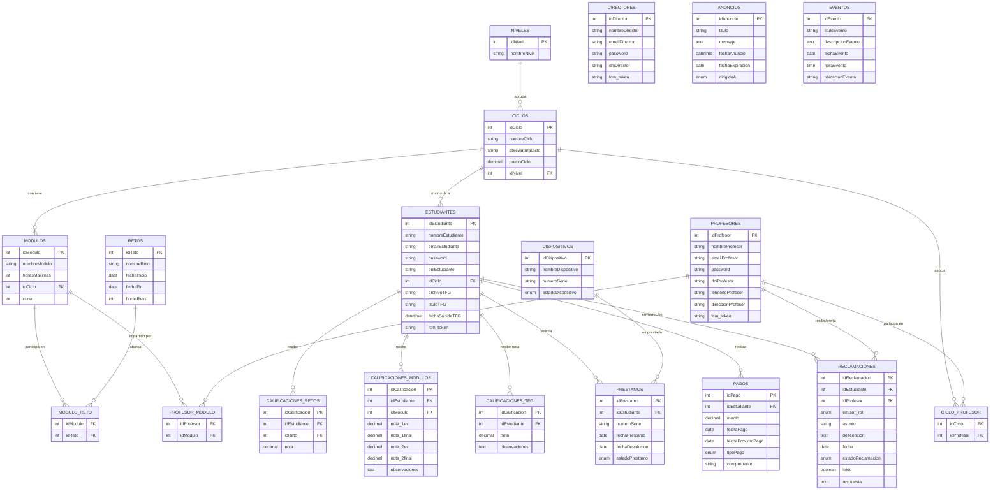
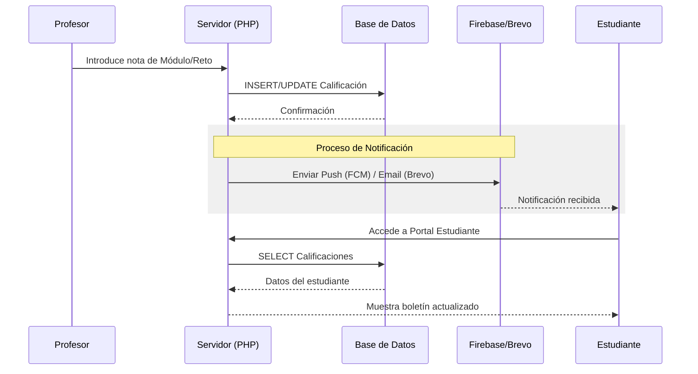

# Diagramas de AulaPro

Este documento contiene la representación visual de la arquitectura de datos y los flujos de trabajo principales del sistema AulaPro.

## 1. Diagrama Entidad-Relación (Base de Datos)

El sistema utiliza una base de datos relacional MySQL con 20 tablas organizadas para soportar la gestión multi-rol.

## 2. Flujo de Calificación y Notificación

## 3. Descripción de Bloques Funcionales
- **Estructura Académica:** Control de Niveles, Ciclos y Módulos.
- **Gestión de Usuarios:** Repositorio centralizado de Directores, Profesores y Estudiantes con autenticación propia.
- **Evaluación Mixta:** Sistema que combina calificaciones tradicionales de módulos con la metodología ABP (Retos).
- **Servicios del Centro:** Gestión de inventario tecnológico, control de cobros (Pagos) y organización de eventos.
- **Comunicación Interna:** Tablón de anuncios, mensajería de reclamaciones y sistema de notificaciones push.
