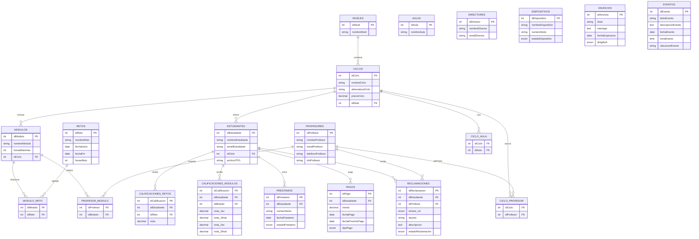
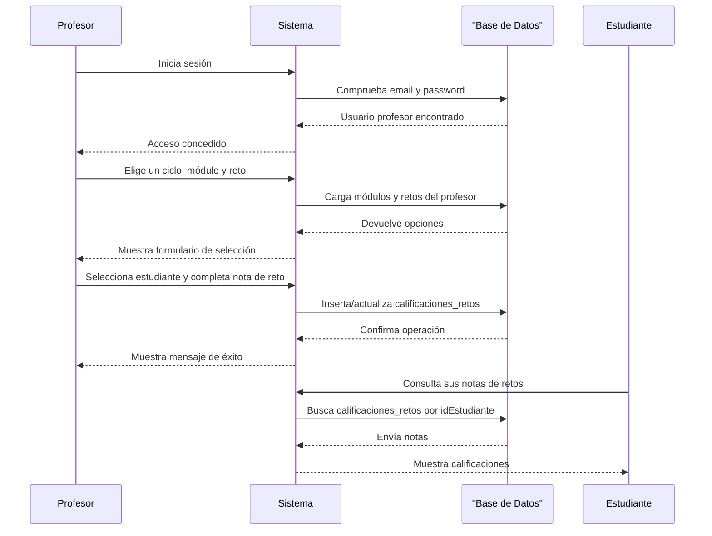

# Diagramas del Proyecto

## Diagrama ER (Entidad-Relación)

## Diagrama de Secuencia (Profesor califica un reto)

## Tablas de la base de datos

- `niveles`: grados formativos del centro (Grado Medio/Superior).
- `aulas`: aulas y laboratorios disponibles.
- `ciclos`: ciclos formativos como DAW, DAM y SMR.
- `modulos`: módulos que pertenecen a cada ciclo.
- `profesores`: profesores con sus datos y credenciales.
- `estudiantes`: estudiantes con ciclo asignado y archivo TFG.
- `directores`: directores y administrador del sistema.
- `retos`: retos del curso con fechas y horas.
- `modulo_reto`: relación de qué módulos participan en cada reto.
- `calificaciones_retos`: notas de reto por estudiante.
- `calificaciones_modulos`: notas de módulo por estudiante.
- `dispositivos`: inventario de dispositivos.
- `prestamos`: préstamos de dispositivos a estudiantes.
- `anuncios`: comunicados para todos, estudiantes o profesores.
- `eventos`: eventos del centro con fecha y ubicación.
- `reclamaciones`: reclamaciones de estudiantes o profesores.
- `pagos`: pagos realizados por estudiantes.
- `ciclo_profesor`: asignaciones de profesores a ciclos.
- `ciclo_aula`: asignaciones de aulas a ciclos.
- `profesor_modulo`: módulos que imparte cada profesor.

## Cómo funciona el proyecto

- El sistema usa roles reales: `directores` (incluye admin), `profesores` y `estudiantes`.
- `ciclos` se agrupan por `niveles` y contienen `modulos`.
- Los profesores se asignan a ciclos y módulos mediante `ciclo_profesor` y `profesor_modulo`.
- Los retos se vinculan a módulos con `modulo_reto`.
- Las notas se guardan en `calificaciones_retos` para retos y `calificaciones_modulos` para módulos.
- Los estudiantes pueden pagar con registros en `pagos`, enviar reclamaciones en `reclamaciones`, ver anuncios y eventos.
- El inventario usa `dispositivos` y `prestamos` para controlar equipos prestados.

## Datos del proyecto reales en `database.sql`

- Hay ciclos de ejemplo: `Desarrollo de Aplicaciones Web` (DAW), `Desarrollo de Aplicaciones Multiplataforma` (DAM), `Sistemas Microinformáticos y Redes` (SMR).
- Hay módulos como `Programación`, `Bases de Datos`, `Desarrollo Web en Entorno Cliente` y `Desarrollo Web en Entorno Servidor`.
- Hay dos profesores de prueba y cuatro estudiantes de ejemplo.
- Se crearon dos retos: `PROYECTO E-COMMERCE PHP` y `CONFIGURACIÓN RED CORPORATIVA`.
- También hay anuncios de mantenimiento y entrega de proyectos, y eventos como ciberseguridad y graduación.
## Cómo usar estos diagramas

- Abre `diagramas.md` en VS Code con la extensión Mermaid.
- O copia el contenido a https://mermaid.live/ para ver las imágenes.

## Nota

El entorno no pudo generar las imágenes locales porque `npx` falló por permisos en la caché. El archivo Markdown ya está listo para visualizar como gráficos Mermaid.
