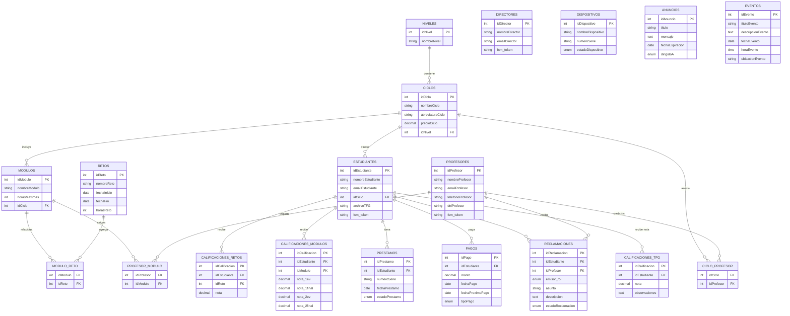
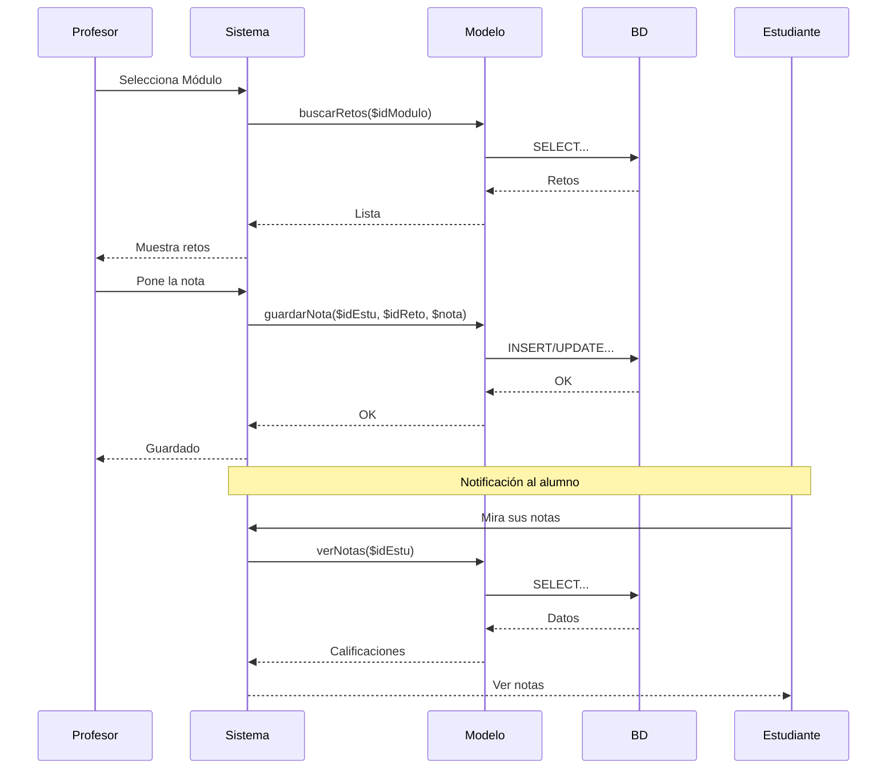

# Diagramas de AulaPro

Aquí están los esquemas de cómo está montada la base de datos y cómo funciona la parte de las notas.

## Diagrama Entidad-Relación (Base de Datos)

## Flujo de Calificación (Secuencia)

## Listado de Tablas
- `niveles`: Grado Medio o Superior.
- `ciclos`: DAW, DAM, SMR, etc.
- `modulos`: Asignaturas.
- `profesores`: Datos del equipo docente.
- `estudiantes`: Alumnos matriculados.
- `directores`: Administradores.
- `retos`: Proyectos ABP.
- `modulo_reto`: Qué retos van con qué módulos.
- `calificaciones_retos`: Notas de los proyectos.
- `calificaciones_modulos`: Notas de exámenes.
- `dispositivos` y `prestamos`: Gestión de portátiles.
- `anuncios`: Tablón de avisos.
- `eventos`: Calendario escolar.
- `reclamaciones`: Mensajes internos.
- `pagos`: Control de cuotas.
- `ciclo_profesor` y `profesor_modulo`: Asignaciones de trabajo.
