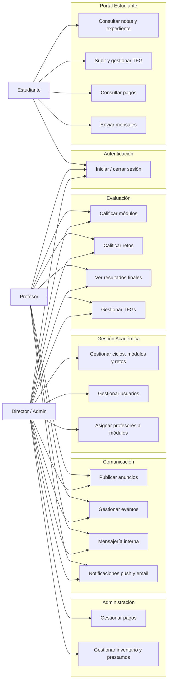

# Diagrama de Casos de Uso — AulaPro (TFG)

Sistema de gestión académica para centros de Formación Profesional con tres portales independientes.

---

## 1. Actores del Sistema

| Actor | Descripción |
|---|---|
| **Director / Admin** | Máximo privilegio. Gestiona la estructura completa del centro. |
| **Profesor** | Evalúa a los estudiantes en los módulos y retos que tiene asignados. |
| **Estudiante** | Usuario final. Consulta su expediente y utiliza los servicios del centro. |

---

## 2. Casos de Uso por Actor

### Director / Administrador
- Iniciar y cerrar sesión
- Ver panel de control con estadísticas globales
- Gestionar usuarios: alta, modificación y baja de directores, profesores y estudiantes
- Gestionar estructura académica: ciclos, módulos, retos y niveles
- Asignar profesores a ciclos y módulos
- Gestionar pagos de matrículas y mensualidades
- Gestionar inventario de dispositivos (alta, modificación, baja)
- Gestionar préstamos de dispositivos a estudiantes
- Publicar anuncios dirigidos a todos, a estudiantes o a profesores
- Crear y gestionar eventos del calendario escolar
- Ver y responder mensajes del buzón interno (reclamaciones)
- Ver y gestionar todos los TFGs subidos por los estudiantes
- Calificar el TFG de los estudiantes
- Consultar calificaciones de módulos y retos
- Ver resultados finales de todos los estudiantes
- **Generar documentación en PDF**: boletines de notas, certificados académicos y sobres
- **Envío masivo de notas**: notificar por email a todos los estudiantes de sus resultados

### Profesor
- Iniciar y cerrar sesión
- Ver panel de control con sus estadísticas
- Ver lista de estudiantes de sus ciclos
- Ver sus ciclos y módulos asignados
- Introducir y modificar notas de módulos (1ª evaluación, finales, 2ª convocatoria)
- Calificar retos de los estudiantes
- Ver resultados finales calculados (75% módulos + 25% retos)
- Ver y gestionar los TFGs de sus estudiantes
- Publicar anuncios para sus alumnos
- Enviar y responder mensajes del buzón interno
- Ver eventos del calendario escolar
- Editar su perfil (nombre, email, teléfono)
- Recibir notificaciones push (Firebase) y por email (Brevo)

### Estudiante
- Iniciar y cerrar sesión
- Ver panel de control con resumen de su actividad
- Consultar notas de módulos con desglose por evaluación
- Consultar notas de retos
- Ver resultado final de su ciclo
- Subir, actualizar o eliminar su TFG (archivo PDF)
- Consultar historial de pagos y estado de matrícula
- Enviar mensajes al equipo docente o administración
- Ver respuestas a sus mensajes
- Ver anuncios publicados
- Ver eventos del calendario escolar
- Editar su perfil (nombre, email, teléfono)
- Recibir notificaciones push (Firebase)

---

## 3. Diagrama Mermaid (Casos de Uso)

> Mermaid no tiene tipo nativo `usecaseDiagram`. Se representa con `flowchart LR` agrupando por paquetes funcionales.

---

## 4. Relaciones entre Casos de Uso

| Relación | Descripción |
|---|---|
| `<<include>>` Calcular nota final | Los casos UC7 (resultados finales) incluyen siempre el cálculo 75%/25% |
| `<<include>>` Validar sesión | Todos los casos de uso requieren sesión activa del rol correspondiente |
| `<<extend>>` Enviar email al calificar | UC5 puede extenderse enviando un email al estudiante vía Brevo API |
| `<<extend>>` Enviar push al publicar anuncio | UC11 puede extenderse enviando notificación push vía Firebase |
