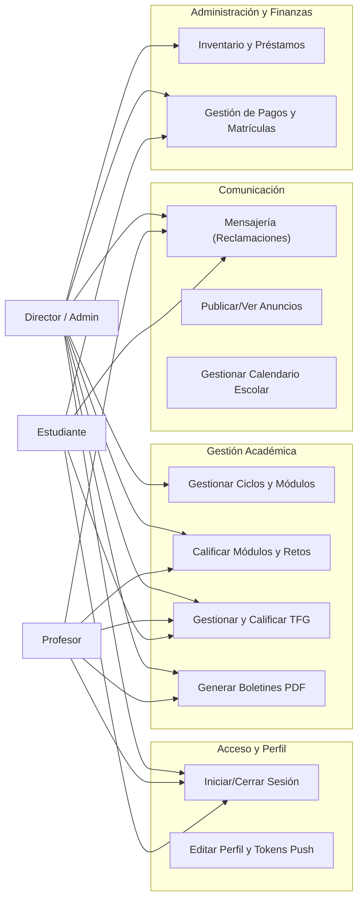

# Diagrama de Casos de Uso — AulaPro (TFG)

AulaPro es un ecosistema digital para la gestión de centros de FP, estructurado en tres portales con casos de uso específicos y compartidos.

---

## 1. Actores del Sistema

| Actor | Descripción |
|---|---|
| **Administrador / Director** | Usuario con control total sobre la configuración del centro, usuarios y finanzas. |
| **Profesor** | Encargado de la evaluación académica (módulos y retos) y tutoría de ciclos. |
| **Estudiante** | Usuario final que consulta su progreso académico y gestiona su expediente. |

---

## 2. Casos de Uso Detallados

### 📂 Gestión de Estructura y Usuarios (Solo Admin)
- **CU01: Gestión de Centros:** Crear y editar Niveles (Grado Medio/Superior) y Ciclos Formativos.
- **CU02: Gestión de Usuarios:** Altas, bajas y modificaciones de personal docente y alumnado.
- **CU03: Asignación Académica:** Vincular profesores a ciclos y módulos específicos.
- **CU04: Control de Inventario:** Gestionar el stock de dispositivos y supervisar préstamos activos.

### 🎓 Gestión Académica y Evaluación (Admin y Profesores)
- **CU05: Calificación de Módulos:** Introducir notas de las evaluaciones (1ª, 2ª, finales).
- **CU06: Evaluación por Retos (ABP):** Calificar proyectos transversales que afectan a varios módulos.
- **CU07: Gestión de TFG:** Subida por parte del alumno; revisión y calificación por parte del tutor/admin.
- **CU08: Generación de Documentación:** Creación de boletines de notas y certificados en PDF.
- **CU09: Notificación Masiva:** Envío automático de calificaciones por email a todo un grupo.

### 💬 Comunicación y Servicios (Todos los Roles)
- **CU10: Mensajería Interna:** Sistema de "Reclamaciones" para soporte y consultas entre roles.
- **CU11: Tablón de Anuncios:** Publicación de avisos con fecha de expiración dirigidos a colectivos.
- **CU12: Calendario de Eventos:** Consulta y gestión de hitos escolares (exámenes, charlas, festivos).
- **CU13: Gestión de Perfil:** Actualización de datos de contacto y recepción de notificaciones push.

### 💰 Gestión Financiera (Admin y Estudiante)
- **CU14: Control de Pagos:** El Admin registra cobros; el Estudiante consulta su historial y próximos recibos.

---

## 3. Diagrama Mermaid (Visualización Funcional)

---

## 4. Lógica de Inclusión y Extensión

- **<<include>> Autenticación:** Todos los casos de uso requieren que el usuario esté logueado.
- **<<include>> Cálculo de Notas:** La visualización de boletines incluye el cálculo automático 75/25.
- **<<extend>> Notificación Push:** Al calificar un reto (CU06), se extiende el envío de una notificación push al móvil del alumno.
- **<<extend>> Email Brevo:** Al generar el boletín final, se extiende el envío del PDF por email al estudiante.
