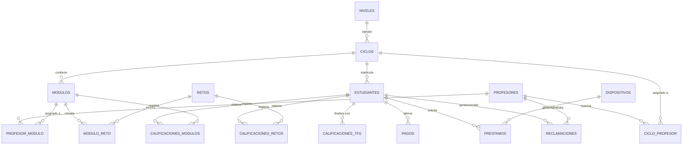

# Modelo de Datos — AulaPro (TFG)

Arquitectura de datos relacional diseñada en MySQL para la gestión integral de un centro de Formación Profesional.

---

## 1. Bloques de Entidades

### 🏫 Bloque 1: Estructura Educativa
- **NIVELES**: Clasificación académica (Grado Medio / Superior).
- **CICLOS**: Programas formativos (ej: DAW, SMR). Incluye precio de matrícula.
- **MODULOS**: Asignaturas que componen un ciclo. Tienen horas totales y curso (1º/2º).

### 👥 Bloque 2: Usuarios y Roles
- **DIRECTORES**: Administradores con acceso total.
- **PROFESORES**: Personal docente con gestión de módulos y tutoría de ciclos.
- **ESTUDIANTES**: Alumnos matriculados en un ciclo. Incluye campos para la gestión del TFG (`archivoTFG`, `tituloTFG`, `fechaSubidaTFG`).
- *Nota:* Todos los usuarios disponen de `fcm_token` para notificaciones push.

### 📝 Bloque 3: Evaluación y Seguimiento
- **RETOS**: Proyectos ABP con fechas y carga horaria.
- **MODULO_RETO**: Relación N:M que define qué retos evalúan qué competencias de qué módulos.
- **CALIFICACIONES_MODULOS**: Notas de exámenes y evaluaciones tradicionales.
- **CALIFICACIONES_RETOS**: Notas de proyectos transversales.
- **CALIFICACIONES_TFG**: Evaluación final del proyecto de grado.

### 🛠️ Bloque 4: Servicios y Administración
- **DISPOSITIVOS**: Inventario de hardware (portátiles, tablets).
- **PRESTAMOS**: Registro de entrega y devolución de dispositivos a alumnos.
- **PAGOS**: Control de cuotas mensuales o únicas con registro de comprobantes.

### 📢 Bloque 5: Comunicación y Eventos
- **ANUNCIOS**: Tablón público con expiración automática.
- **EVENTOS**: Calendario de hitos del centro (ubicación, fecha, hora).
- **RECLAMACIONES**: Sistema de tickets/mensajería con estados (pendiente/atendido) y confirmación de lectura.

---

## 2. Lógica de Negocio y Reglas de Integridad

- **Cálculo de Nota Final**: No se almacena físicamente. Se obtiene mediante la fórmula: `(Promedio Módulos * 0.75) + (Promedio Retos * 0.25)`.
- **Relaciones de Tutoría**: Un profesor puede ser tutor de varios ciclos (`ciclo_profesor`) e impartir múltiples módulos (`profesor_modulo`).
- **Integridad Referencial**: Uso de `ON DELETE CASCADE` en calificaciones y asignaciones para asegurar la limpieza de datos al dar de baja alumnos o módulos.
- **Trazabilidad de TFG**: El archivo se asocia al perfil del estudiante, pero la evaluación reside en una tabla independiente para permitir observaciones detalladas del tutor.

---

## 3. Diagrama Mermaid (Entidad-Relación)

