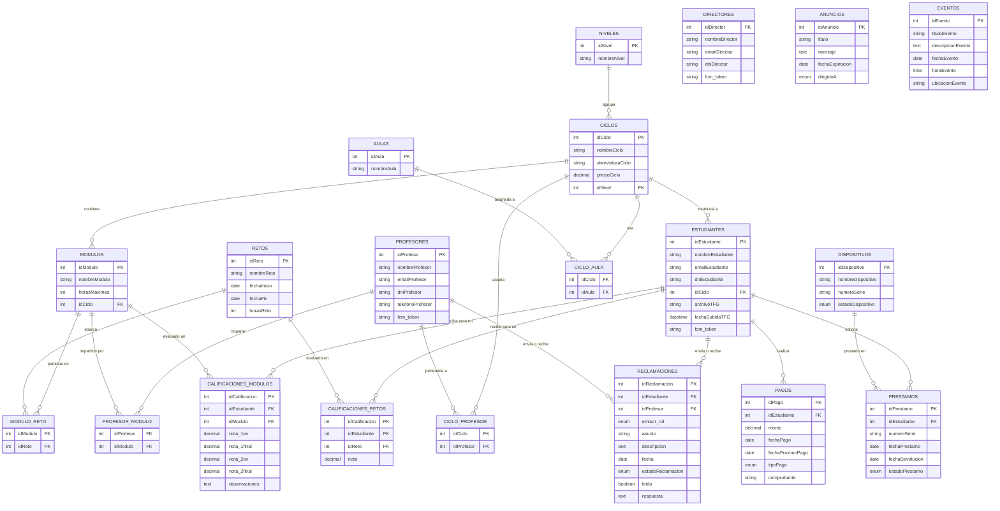

# Diagrama Entidad-Relación — AulaPro (TFG)

Base de datos relacional MySQL con 20 tablas organizadas en 5 bloques funcionales.

---

## 1. Bloques de la Base de Datos

### Bloque 1 — Estructura Educativa
- **NIVELES**: Grado Medio o Grado Superior. Agrupa ciclos.
- **CICLOS**: Programa formativo completo (DAW, SMR, DAM). Pertenece a un nivel, tiene precio.
- **MODULOS**: Asignaturas individuales de un ciclo, con horas máximas.
- **AULAS**: Espacios físicos del centro.

### Bloque 2 — Usuarios
- **DIRECTORES**: Control total del sistema. Tienen DNI, email, contraseña y token FCM para notificaciones push.
- **PROFESORES**: Imparten módulos y evalúan retos. Tienen DNI, teléfono, dirección y token FCM.
- **ESTUDIANTES**: Matriculados en un ciclo. Tienen DNI, token FCM, y dos campos para el TFG (`archivoTFG`, `fechaSubidaTFG`).

### Bloque 3 — Académico y Evaluación
- **RETOS**: Proyectos transversales con fechas de inicio/fin y horas estimadas.
- **MODULO_RETO** *(pivot)*: Un reto puede abarcar varios módulos y viceversa.
- **CALIFICACIONES_MODULOS**: Nota de un estudiante en un módulo. Guarda 4 valores: 1ª Evaluación, 1ª Final, 2ª Evaluación, 2ª Final, más observaciones del profesor.
- **CALIFICACIONES_RETOS**: Nota global (0–10) de un estudiante en un reto.

### Bloque 4 — Asignaciones (Tablas Pivot)
- **CICLO_PROFESOR**: Relaciona profesores con los ciclos en que son tutores.
- **PROFESOR_MODULO**: Relaciona exactamente qué módulos imparte cada profesor.
- **CICLO_AULA**: Asigna aulas a ciclos.

### Bloque 5 — Administración y Comunicación
- **PAGOS**: Cuotas abonadas por estudiantes. Incluye tipo (mensual, trimestral…), comprobante y próxima fecha de cobro.
- **DISPOSITIVOS**: Inventario de hardware del centro (número de serie, estado: disponible/prestado).
- **PRESTAMOS**: Relaciona un estudiante con un dispositivo. Registra fechas de entrega y devolución, y estado (en curso/devuelto).
- **ANUNCIOS**: Avisos con fecha de expiración, dirigidos a todos, estudiantes o profesores.
- **EVENTOS**: Calendario escolar con hora y ubicación.
- **RECLAMACIONES**: Sistema de mensajería interna. Puede ser enviado por estudiante, profesor o admin. Tiene estado (pendiente/atendido), campo de respuesta y flag de leído.

---

## 2. Lógica de Negocio Clave

- **Nota final de módulo**: No se almacena directamente. Se calcula en tiempo de ejecución: 75% del promedio de `CALIFICACIONES_MODULOS` (convocatorias) + 25% del promedio de `CALIFICACIONES_RETOS` asociados via `MODULO_RETO`.
- **TFG**: No tiene tabla propia. Los campos `archivoTFG` (ruta del PDF) y `fechaSubidaTFG` están directamente en la tabla `ESTUDIANTES`.
- **Notificaciones push**: Los tres tipos de usuario (director, profesor, estudiante) tienen un campo `fcm_token` para recibir notificaciones vía Firebase Cloud Messaging.
- **Préstamos**: La tabla `PRESTAMOS` referencia a `DISPOSITIVOS` por `numeroSerie` (clave de negocio), no por `idDispositivo`.

---

## 3. Diagrama Mermaid (Entidad-Relación)

