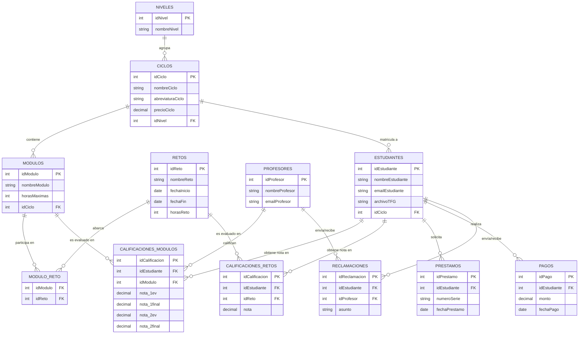

# Contexto de la Base de Datos: Portal de Gestión Educativa (PFC)

Este texto explica en detalle la estructura de datos del proyecto para ser utilizado como prompt en la generación o comprensión del **Diagrama Entidad-Relación (ER)**.

## 1. Arquitectura de la Base de Datos
El proyecto utiliza una base de datos relacional (MySQL) estructurada para soportar metodologías educativas modernas, como el aprendizaje basado en retos (Ethazi), además de los módulos tradicionales. La base de datos está fuertemente normalizada para asegurar la integridad referencial.

## 2. Entidades Principales y sus Funciones

### Jerarquía Educativa
- **NIVELES**: Define el grado formativo (ej. Grado Medio, Grado Superior). Un nivel agrupa múltiples ciclos.
- **CICLOS**: Representa un programa educativo completo (ej. DAW, SMR). Tiene un precio asociado y pertenece a un nivel.
- **MODULOS**: Son las asignaturas individuales que componen un ciclo formativo. Tienen un número máximo de horas.
- **RETOS**: Son proyectos prácticos y transversales. Tienen fechas de inicio/fin y horas estimadas. 
- **MODULO_RETO (Tabla pivote)**: Relaciona qué módulos (asignaturas) participan en qué retos. Un reto puede abarcar varios módulos y un módulo puede participar en varios retos.

### Entidades de Usuarios
- **DIRECTORES**: Usuarios con control total del sistema.
- **PROFESORES**: Tienen datos de contacto (DNI, Teléfono). Se vinculan a Ciclos y a Módulos específicos a través de tablas intermedias.
- **ESTUDIANTES**: Alumnos matriculados obligatoriamente en un Ciclo. Tienen un campo para subir su Trabajo de Fin de Grado (TFG).

### Relaciones Académicas (Tablas Pivote / Asignaciones)
- **CICLO_PROFESOR**: Relaciona a los profesores con los ciclos en los que son tutores o imparten clase.
- **PROFESOR_MODULO**: Relaciona exactamente qué módulos imparte un profesor concreto.
- **CICLO_AULA**: Asigna espacios físicos (Aulas) a los ciclos.

### Entidades de Evaluación
- **CALIFICACIONES_MODULOS**: Almacena las notas de un estudiante en un módulo específico. Guarda 4 valores: 1ª Evaluación, 1ª Final, 2ª Evaluación, 2ª Final y observaciones del profesor.
- **CALIFICACIONES_RETOS**: Almacena la nota global (0 a 10) que obtiene un estudiante en un reto práctico concreto.

### Entidades de Gestión Administrativa
- **PAGOS**: Registra las cuotas abonadas por los estudiantes, montos y próximas fechas de cobro.
- **DISPOSITIVOS**: Inventario físico del hardware del centro (número de serie, estado).
- **PRESTAMOS**: Relaciona a un estudiante con un dispositivo físico, registrando las fechas de entrega y devolución.

### Entidades de Comunicación
- **RECLAMACIONES**: Tickets de soporte. Un estudiante o un profesor puede ser el emisor. Tiene un estado (Pendiente, Resuelto).
- **ANUNCIOS y EVENTOS**: Registros de avisos en el tablón (con fecha de expiración) y calendario de eventos con ubicación física/virtual.

---

## 3. Lógica de Negocio Crucial en el Diseño ER
- **El Cálculo de la Nota Final**: La base de datos almacena las notas separadas. A nivel lógico, la nota de un módulo pesa un 75% y el promedio de los retos asociados a ese módulo pesa el 25% restante. Las tablas `CALIFICACIONES_MODULOS`, `CALIFICACIONES_RETOS` y `MODULO_RETO` son las piezas centrales de este cálculo.
- **TFG**: En lugar de crear una tabla separada, la tabla `ESTUDIANTES` cuenta con un campo directo `archivoTFG` que guarda la ruta del documento subido.

---

## 4. Código Mermaid para el Diagrama ER

A continuación, tienes el código listo en sintaxis Mermaid para renderizar la arquitectura en un diagrama visual:

